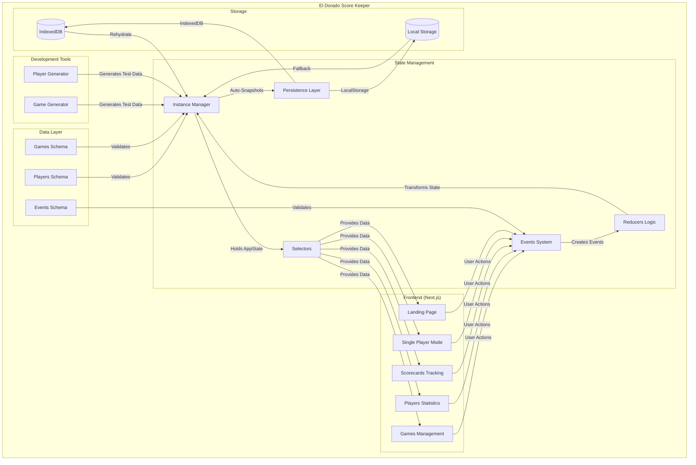
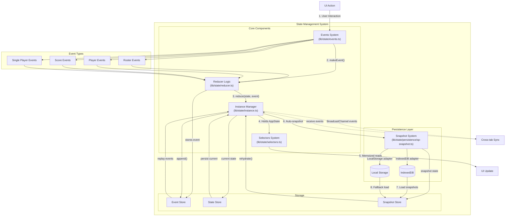
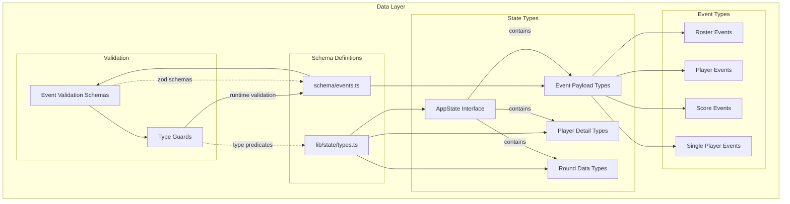
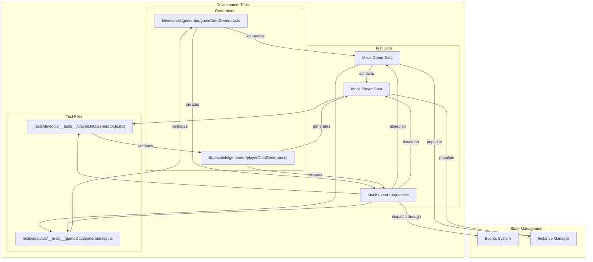

# App Architecture Overview

## High-Level Architecture & Data Flow

## Frontend Architecture & Component Data Flow

```mermaid
flowchart TD
    subgraph "Frontend Components"
        subgraph "Pages"
            GamesPage["games/page.tsx"]
            PlayerStats["players/[playerId]/statistics/"]
            ScorecardSummary["scorecard/[scorecardId]/summary/"]
            SinglePlayerApp["single-player/SinglePlayerApp.tsx"]
            LandingPage["landing/page.tsx"]
        end

        subgraph "Modals"
            DeleteModal["@modal/delete/DeleteGameModalClient.tsx"]
            RestoreModal["@modal/restore/RestoreGameModalClient.tsx"]
        end

        subgraph "Components"
            AdvancedInsights["AdvancedInsightsPanel.tsx"]
            ScorecardSummaryComp["ScorecardSummaryPageClient.tsx"]
            SinglePlayerNew["SinglePlayerNewPageClient.tsx"]
        end
    end

    subgraph "State Management"
        EventsSystem[Events System]
        Selectors[Selectors]
    end

    %% Component Data Flow
    GamesPage --> |"dispatches delete events"| EventsSystem
    GamesPage --> |"dispatches restore events"| EventsSystem
    GamesPage --> |"reads game data"| Selectors

    PlayerStats --> |"reads player stats"| Selectors
    ScorecardSummary --> |"reads scorecard data"| Selectors
    SinglePlayerApp --> |"dispatches game events"| EventsSystem
    SinglePlayerApp --> |"reads game state"| Selectors
    LandingPage --> |"reads app state"| Selectors

    %% Component Relationships
    GamesPage --> DeleteModal
    GamesPage --> RestoreModal
    PlayerStats --> AdvancedInsights
    ScorecardSummary --> ScorecardSummaryComp
    SinglePlayerApp --> SinglePlayerNew

    %% Modal Interactions
    DeleteModal --> |"confirm delete"| EventsSystem
    RestoreModal --> |"confirm restore"| EventsSystem

    %% Component Interactions
    AdvancedInsights --> |"filter data"| Selectors
    ScorecardSummaryComp --> |"calculate scores"| Selectors
    SinglePlayerNew --> |"create new game"| EventsSystem
```

## State Management Architecture & Data Flow

## Data Schema Architecture & Type Flow

## Development Tools Architecture & Test Data Flow

