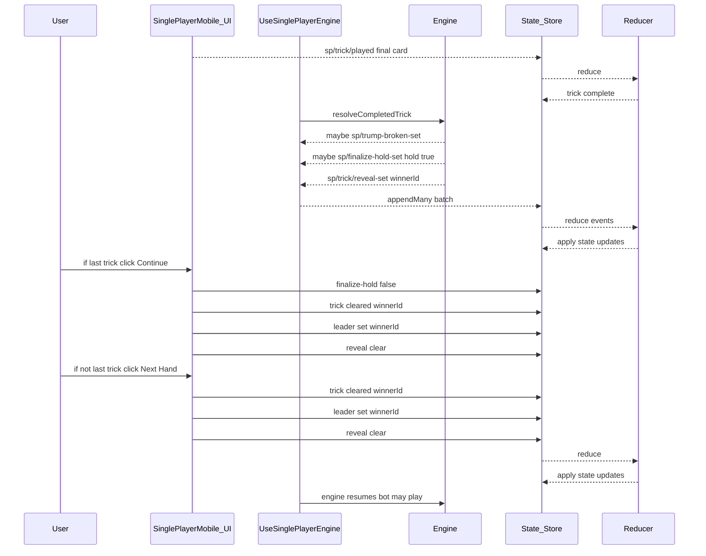
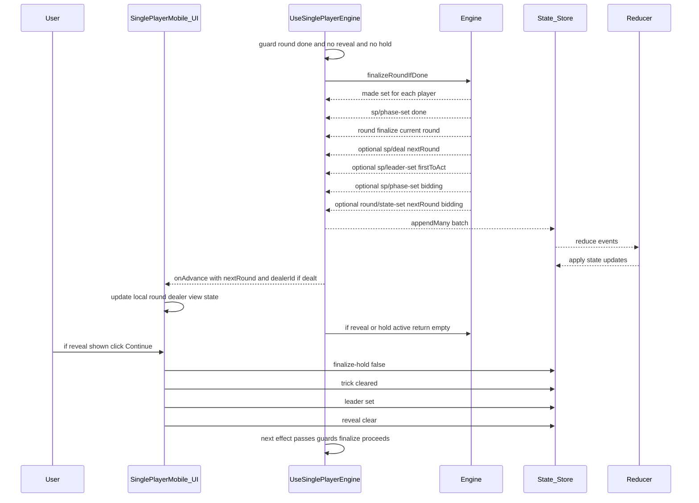

# End‑of‑Turn Flow (Single Player)

This document shows the single‑player state transitions for the end of a hand (trick) and the end of a round, with exact events and reducers involved.

## End Of Hand (Trick)

## End Of Round

## Notes

- Bot plays pause during reveal; resume after `sp/trick/cleared` and `sp/trick/reveal-clear`.
- Round finalization is idempotent and gated by `sp.reveal == null` and `sp.finalizeHold == false`.
- `round/finalize` scores the row and flips the next row to `'bidding'` if it was `'locked'`.
