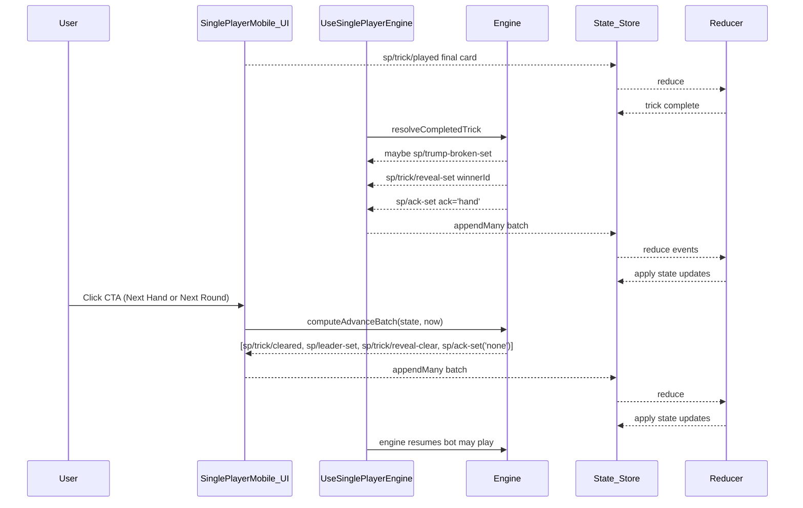
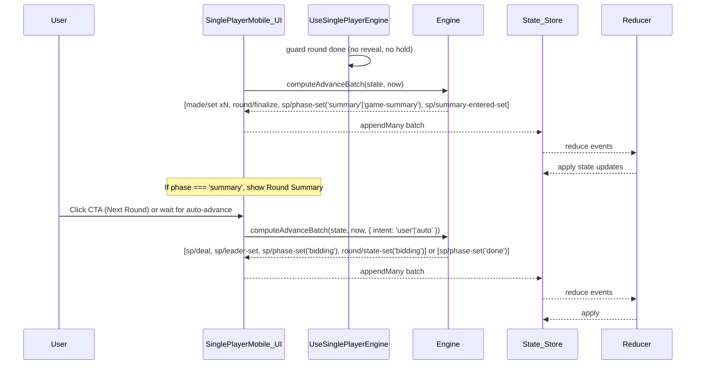

# End‑of‑Turn Flow (Single Player)

This document shows the single‑player state transitions for the end of a hand (trick) and the end of a round, with exact events and reducers involved.

## End Of Hand (Trick)

## End Of Round

## Notes

- Bot plays pause during reveal and while in summary; resume after `sp/trick/cleared`/`sp/trick/reveal-clear` or when leaving summary.
- Round finalization is idempotent and gated by `sp.reveal == null` (ack handled via CTA flow).
- On entering summary, reducer stores `sp.summaryEnteredAt`; UI auto-advance may call `computeAdvanceBatch(..., { intent: 'auto' })` after the configured timeout.
- `round/finalize` scores the row and flips the next row to `'bidding'` if it was `'locked'`.
